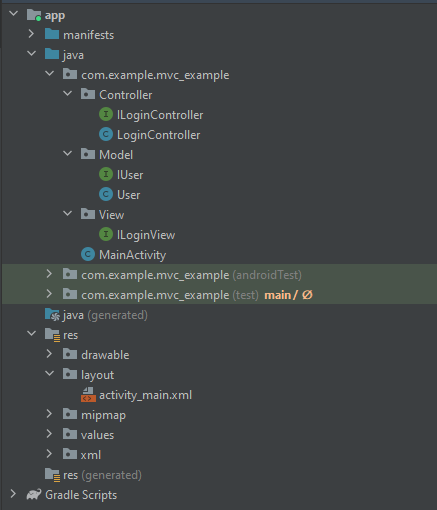
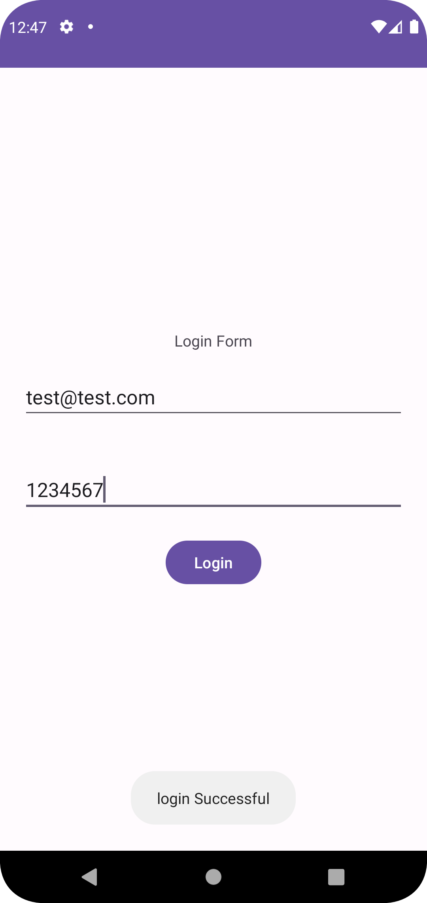

# MVC-Example-Mobile

## Tasarım Desenleri Ödevi

Model -> User  
View ->MainActivity  
Controller -> LoginController  

Bu projede Controller mail ve şifre için belirlediğim kuralları (Mail adresi düzgün girilmiş mi, şifre 6 karakterden fazla mı gibi) kontrol ederek bunu view katmanında Toast mesajı ile kullanıcıya gösterir.
Controller modelimiz içinde bulunan isValid metodundan dönen koda göre bu işlemi gerçekleştirir. 
Daha sonra eğer hata varsa view katmanında OnLoginError metodu ile error mesajı, hata yoksa OnLoginSuccess metodu ile success mesajı kullanıcıya gösterilir.

## Klasör Yapısı

## Uygulama Ekran Görüntüsü

